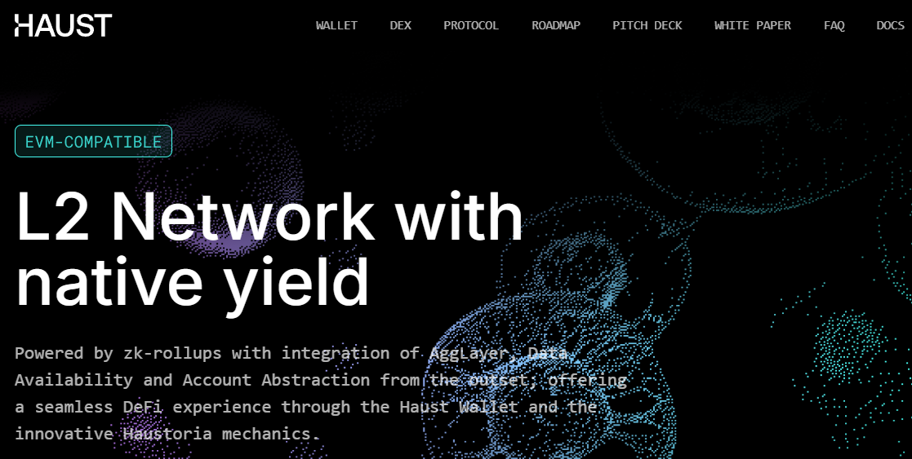
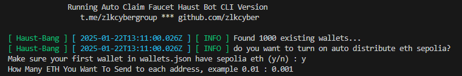

# HAUST AUTO CLAIM FAUCET


- Website https://haust.network/

## What Is Haust Network

Haust Network: A Versatile Blockchain Solution

Haust is a built on Ethereum Virtual Machine (EVM) blockchain specifically designed for micropayment solutions and gas-intensive smart contracts. Haust Network is a versatile project that leverages the permissionless nature of blockchain technology to deliver innovative solutions.

It provides decentralized finance (DeFi) solutions and also pioneers the implementation of a symbiotic network.

Haust boasts hight security low commissions and provides its own SDK for native integrations with Telegram and other messengers. Notably, the network introduces Haustoria, a feature enabling liquid staking on various networks directly connected to Haust.

## Auto Mint NFT
- its will try to mint using existing wallet in `wallets.json`
   ```bash
   npm run mint
   ```

## auto mint / bridge and distribute eth
- auto distribute eth sepilia to another addr in wallets json
- just input `y` if you want to auto distribute eth to another wallet
- input `n` to continue mint and bridge process
- make sure your first wallet in wallets.json have enought eth sepolia
   ```
   npm run bridge
   ```

   
   
## Update
- add auto deploy and interact with contract
- `git pull` and re install dependencies `npm install`

- run deploy: 
   ```bash
   npm run deploy
   ```

## Features

- **Auto Generate New Wallets**
- **Auto Claim Faucets To New Address**
- **All Wallets information Saved In wallets.json** 
- **Haust Token Faucet Is Limited so Act Fast**

   

## Requirements

- **Node.js**: Ensure you have Node.js installed.
- **npm**: Ensure you have npm installed.


## Setup

1. Clone this repository:
   ```bash
   git clone https://github.com/Zlkcyber/haustBot.git
   cd haustBot
   ```
2. Install dependencies:
   ```bash
   npm install
   ```
3. Setup: to create new wallets 
   ```bash
   npm run setup
   ```
4. Run The Script:
   ```bash
   npm run start
   ```


## 

This project is licensed under the [MIT License](LICENSE).
